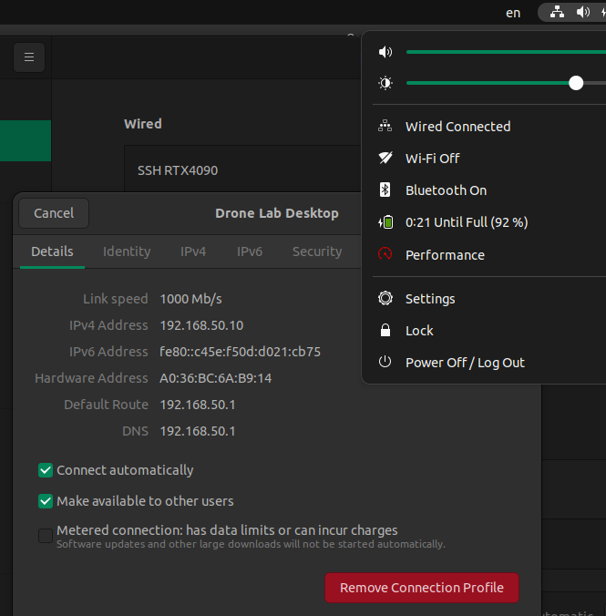

# Task 
obtain motion capture pose data for a rigitd body (asset) over wifi or a LAN (ethernet) connection.

# To Know
- The original `ros-XXX-mocap-optitrack` package doesn't work on ROS 2, so we will use this 3rd party package instead.
- I modified the original repo to work off the bat with the Optitrack setup on Level 18 Drone Lab, the only thing you need to change is the object name.
- for the container to see your own PC's network, you need `--net host` flag when creating your container.
- This repo is only tested on `MotiveBody 3.0.2 Final` software.

# Steps
## Get useful data from the drone lab pc
- Asset Name
- Asset Streaming ID
- Local Interface
- Transmision Type (has to be multicast)
- Command Port
- Data Port
- Multicast Interface

Note: if you don't see the last four checkboxes, click `...` and select `show Advanced`
## Connect to drone lab pc
if using a LAN connection, setup a new wired profile with automatic IPv4 and IPv6

if using wifi, ...

## 

# Thanks
Special thanks to @ivan-sim-wan-leong for setting this up for all of us.